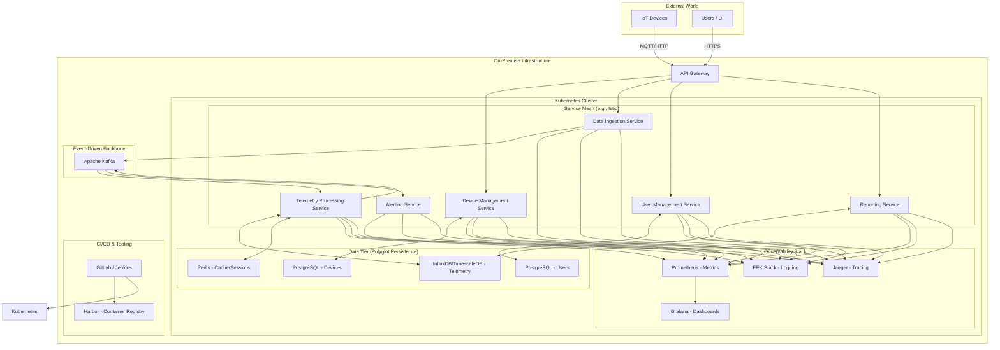

# Target Microservices Architecture - Block Diagram

This diagram illustrates the cloud-native, microservice-based target architecture for the modernized IoT platform, designed to run in a self-hosted, intranet environment.

## Diagram Components Explained

*   **External World**: Represents the clients of the system.
    *   **IoT Devices**: The source of telemetry data, communicating via protocols like MQTT or HTTP.
    *   **Users / UI**: Human users interacting with the system through a web interface.

*   **On-Premise Infrastructure**: All components are self-hosted within the company's intranet.

*   **API Gateway**: The single entry point for all incoming traffic. It routes requests to the appropriate microservices and handles cross-cutting concerns like authentication, rate limiting, and SSL termination.

*   **Kubernetes Cluster**: The core of the platform, responsible for orchestrating and managing all the containerized applications.
    *   **Service Mesh**: Manages inter-service communication, providing features like load balancing, service discovery, retries, circuit breaking, and security (mTLS) automatically.
    *   **Microservices**:
        *   `Device Management Service`: Handles device registration, configuration, and status.
        *   `Data Ingestion Service`: A lightweight service responsible for receiving raw data from devices and publishing it to the Kafka backbone.
        *   `Telemetry Processing Service`: Consumes data from Kafka, performs transformations, applies business logic, and stores the results in the time-series database.
        *   `Alerting Service`: Monitors the processed data for specific conditions and triggers alerts.
        *   `User Management Service`: Handles user authentication and authorization.
        *   `Reporting Service`: Provides APIs for the UI to query data for reports and dashboards.
    *   **Data Tier**: Illustrates the polyglot persistence approach, where each service uses a database best suited to its needs.
        *   `PostgreSQL`: For relational data like device metadata and user information.
        *   `InfluxDB/TimescaleDB`: A time-series database optimized for storing and querying IoT telemetry data.
        *   `Redis`: An in-memory data store for caching and session management.
    *   **Observability Stack**: A crucial set of tools for monitoring and debugging the distributed system.
        *   `Prometheus`: Collects metrics from all services.
        *   `Grafana`: Visualizes metrics in dashboards.
        *   `EFK Stack`: Centralizes logs from all services.
        *   `Jaeger`: Provides distributed tracing to follow a request's lifecycle across multiple services.

*   **Event-Driven Backbone (Apache Kafka)**: Decouples the data ingestion from data processing. This creates a scalable and resilient buffer, allowing the system to handle bursts of data and for services to be independently developed and deployed.

*   **CI/CD & Tooling**: The automation backbone.
    *   `GitLab/Jenkins`: Automates the build, test, and deployment pipelines for each microservice.
    *   `Harbor`: A private container registry to securely store the Docker images of the microservices.
